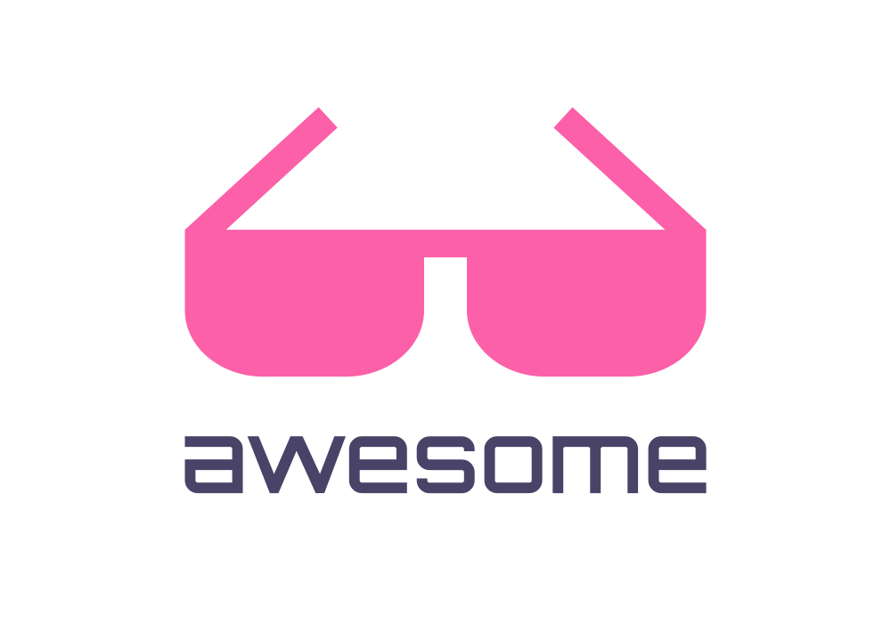

 
 
 
 

    <a href="https://github.com/sponsors/FJrodafo">My open source work is supported by the community!</a>

 
 
 
 

The awesome lists concept originally belongs to <a href="https://github.com/sindresorhus">Sindre Sorhus</a>! Visit their repository, just type <a href="https://awesome.re">awesome.re</a> to go there!

 
 

## Index

* [Topic](#topic)

## Topic

* [Awesome](https://github.com/FJrodafo/Awesome) - Description

 
 
    
Made with ❤️ by the community!

